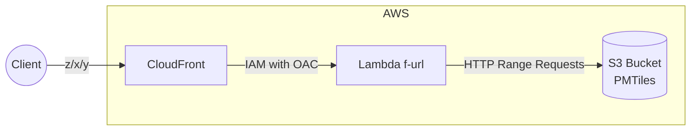

# litiler - Serverless tile-server with PMTiles

Lite🪶, Lit🔥, Tiler🗺️ -> litiler

- Lite: few codes, few dependencies, but fast
- Lit: powered by [Hono](https://github.com/honojs/hono)
- Tiler: accepts z/x/y requests and return tiles

> for Cloudflare, use [litiler-cf](https://github.com/Kanahiro/litiler-cf)

## Local Development

```bash
cp .env.example .env
pnpm install
pnpm dev
# curl http://localhost:5500/tiles/school/metadata.json
```

## Deployment

```bash
cd cdk
npm install
cdk deploy
```

## Diagram



## Usage

- Upload PMTiles to S3 bucket: `sample.pmtiles`
- Fetch metadata or tiles:
    `https://<cloudfront-domain>/tiles/sample/metadata.json`
    `https://<cloudfront-domain>/tiles/sample/{z}/{x}/{y}`
- Ofcourse, you can add more PMTiles to the same bucket.
  - `second.pmtiles` -> `https://<cloudfront-domain>/tiles/second/metadata.json`
  - `third.pmtiles` -> `https://<cloudfront-domain>/tiles/third/{z}/{x}/{y}`
  - more...
